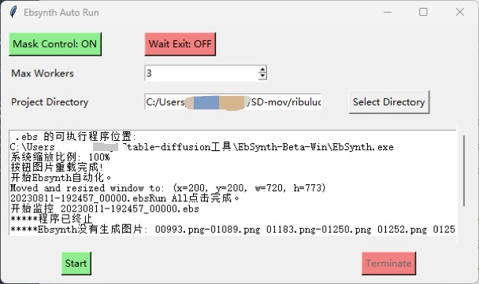

[English version](README_EN.md)
# Ebsynth自动化工具

## 简介：
此工具旨在自动化Ebsynth的运行流程。

## 安装：
1. 克隆GitHub仓库或下载ZIP文件。
2. 使用适当的Python环境（本机开发环境Python3.9）。
3. 在命令行中运行`cd`+`目录路径`。
4. 安装所需的依赖项：（网络问题可替换清华源）。
    ```
    pip install -r requirements.txt
    ```

## 配置：（也可在图形界面中修改）
使用`ebsynth_auto_run_config.ini`进行配置。你可以编辑以下参数：
- **Mask_control**: 看你需不需要遮罩（蒙版按钮），不需要就调成False。默认为True。
- **Max_workers**: 同时运行的ebsynth文件数量，看你电脑的承受能力。默认为3。
- **WAIT_EXIT_REMOTE_DESKTOP**: 30秒内退出远程桌面，远程桌面可能会对鼠标点击造成影响（可以先试试），默认不延迟，有需要改成 True。默认为False。

## 使用：
1. 双击`RunMe.bat`。
2. 选择想要自动化运行的ebs文件目录。
3. 点击`Start`开始自动化。
4. 启动程序后，鼠标不要移动到屏幕角落，会引发程序错误。
5. 程序运行完毕后，会自动检查目录下ebs输出文件与`video_frame`文件夹中图片序列缺少的部分，如无缺失，则会返回”Ebsynth生成图片完整性检查通过！“。


## 终止：
在任何时候，可以点击`Terminate`来终止程序。

## 问题诊断：
1. 确保所有的图像文件和Ebsynth文件都在正确的目录中。
2. 如果遇到问题，检查`ebsynth_auto_run_config.ini`的配置是否正确或查看输出栏错误提示。

## 注意：
- 该工具自动化的是Ebsynth的流程，确保你有适当的权限和所有的依赖项。
- 在使用之前，最好先进行一次手动测试，以确保一切都在正常工作。
